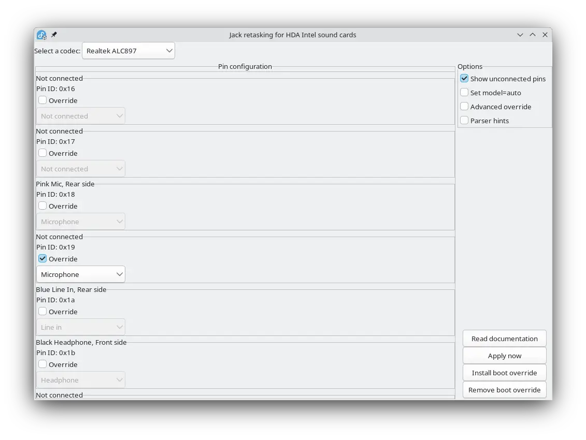

# HDAJackRetask to RPM for immutable distro

## What?

https://github.com/alsa-project/alsa-tools/blob/master/hdajackretask/README

this is the demo repo to showcase how to apply hdajackretask boot overrides to
immutable distros such as fedora kinoite via RPM package.

## Why?

~~it all began with
<https://askubuntu.com/questions/1467947/headset-microphone-not-working-on-ubuntu-23-04-with-alc897/1498356>~~

boot overrides in hdajackretask needs to edit
`/etc/modprobe.d/hda-jack-retask.conf` and `/lib/firmware/hda-jack-retask.fw`,
but `/lib` is read-only in immutable distros. while running

```sh
sudo ostree admin unlock --hotfix
```

unlocks it, next update will rollback the changes, because that's how immutable
distros work.

## How?

### Check that changes via `hdajackretask` works

For `Apply Now` to work, audio services such as `pipiewire` should be stopped
first.

```sh
$ systemctl --user stop pipewire.socket pipewire.service
# in hdajackretask, click Apply Now after making changes
$ systemctl --user restart pipewire.socket pipewire.service
```

### Install Boot Overrides

1. Let `hdajackretask` to write to `/lib/firmware` by

```sh
$ sudo ostree admin unlock --hotfix
```

2. Copy relevant files to `package_files`:

```sh
$ cp /etc/modprobe.d/hda-jack-retask.conf package_files/hda-jack-retask.conf
$ cp /lib/firmware/hda-jack-retask.fw package_files/hda-jack-retask.fw
```

3. Create rpm package:

```sh
$ bash build-rpm.sh
```

4. Install the package:

```sh
# generated RPM package name may change
sudo rpm-ostree install $(pwd)/immutable-hdajackretask/rpmbuild/RPMS/noarch/hda-jack-retask-config-1.0.0-1.fc41.noarch.rpm
```

5. Reboot the PC to apply the changes.

## Use Cases

### Realtek ALC897 Driver

 for some reason, pin 19
is disabled, so it needs to be manually overriden to microphone.

for more info, refer to
<https://askubuntu.com/questions/1467947/headset-microphone-not-working-on-ubuntu-23-04-with-alc897/1498356>

## FAQ

- Q: Isn't this obvious?
- A: Yes, but I'm not smart enough to write a RPM package in oneshot, so thought
  others could reference it.

* Q: How did you learn to do this?
* A: A painful hour with Gemini 2.5 Pro is all you need

- Q: What are the existing `package_files` files for?
- A: It's configuration for [ALC897](#realtek-alc897-driver). See it as an
  example file to compare output to and remove them before putting your own.
